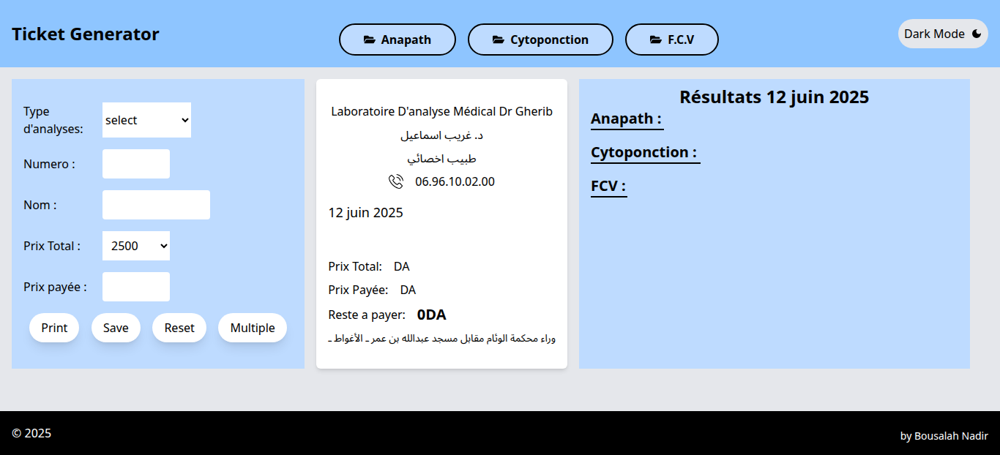
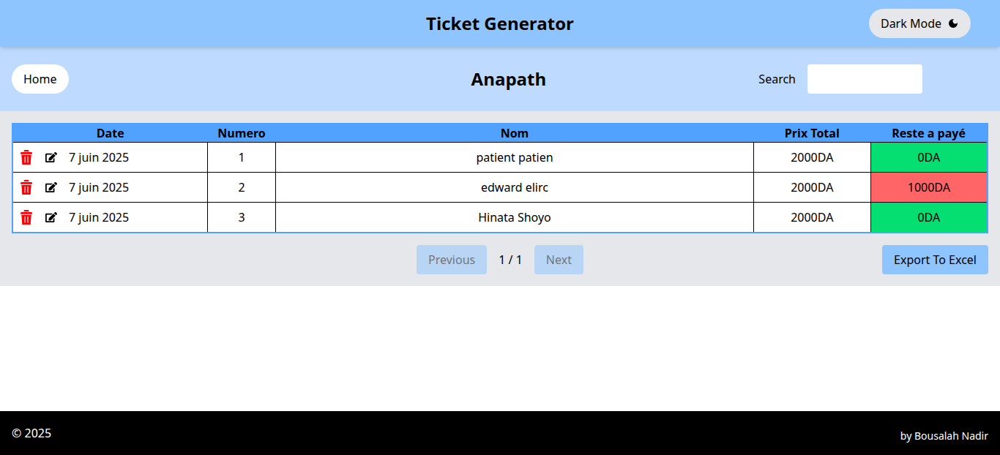

# Office ticket generator
## Table of contents

- [Overview](#overview)
  - [Discription](#the-challenge)
  - [Screenshot](#screenshot)
  - [Links](#links)
- [My process](#my-process)
  - [Built with](#built-with)
- [Author](#author)

## Overview

### Discription

This web application allows users to efficiently manage client records by viewing, searching, editing, and deleting client data, Users can update client details via an editable form and export the entire client archive to an Excel file for offline use.The interface supports dark mode for comfortable viewing and includes print-ready ticket generation. Built with React and enhanced with localStorage for persistent data storage, it ensures seamless client data management in a clean design.

### Screenshot

  ## Home Page and ticket generator
  

  ## DateBase
  

### Links

- Solution URL: [solution](https://github.com/Medido1/office_ticket_generator)
- Live Site URL: [live site](https://officeticketgenerator.netlify.app/)

## My process

### Built with

- TailwindCSS
- React
- Flexbox

## Author

- GitHub - [@Medido1](https://github.com/Medido1)

